# Bridgemap — Counseling × Clinical Knowledge Graph

An instrumented, bilingual (ko/en) knowledge graph of Korean 상담심리 (counseling) and 임상심리 (clinical) psychology curricula, built as a **CSCL research tool** in the Scardamalia / Oshima / Shaffer lineage. Every click, path, annotation, discussion post, and case anchoring is captured as an event trace and is analyzable as a learning-process record.

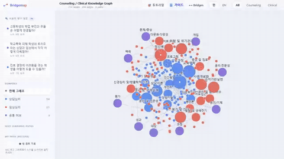

> **Status.** Phase 0 — localhost scaffold + static GitHub Pages preview. Not yet IRB-ready. Not yet deployed to a live cohort.
>
> **Live demo.** [educatian.github.io/counseling-graph-cscl](https://educatian.github.io/counseling-graph-cscl/)
> **Guidebook.** [/guide/index.html](https://educatian.github.io/counseling-graph-cscl/guide/index.html)

---

## Screenshots

### Full graph — counseling × clinical with bridge hubs

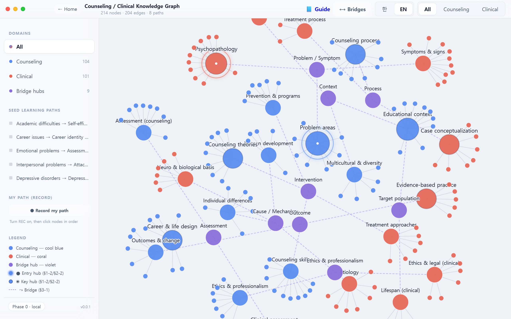

### Bridge overlay — §3-1 shared hubs highlighted

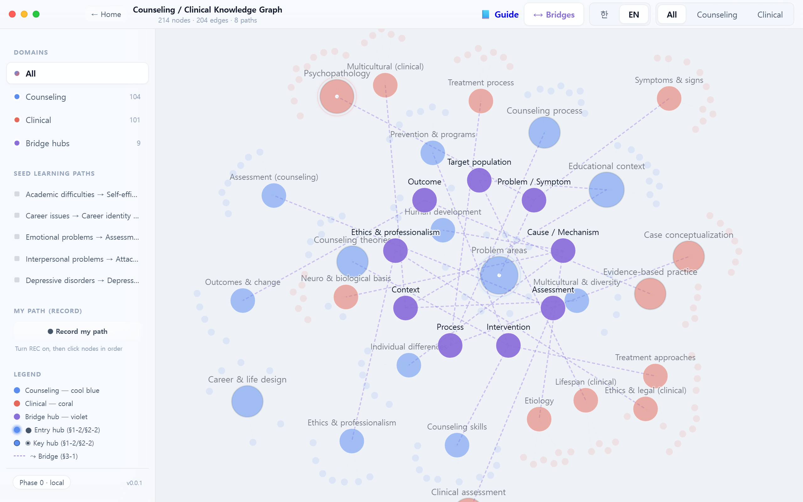

### Domain filter — counseling subgraph

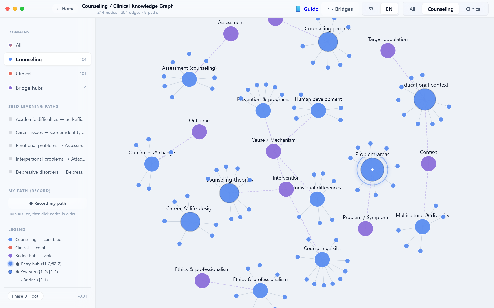

### English labels (language toggle)

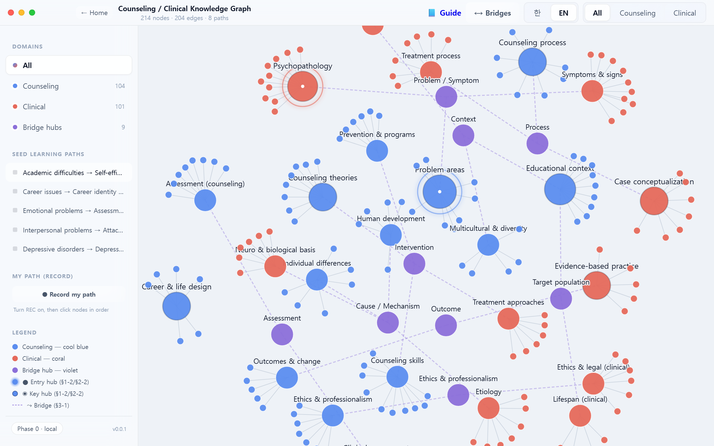

### Node detail — description, discussion, cases, notes

| Description | Discussion (Q/C/E moves) |
|---|---|
| 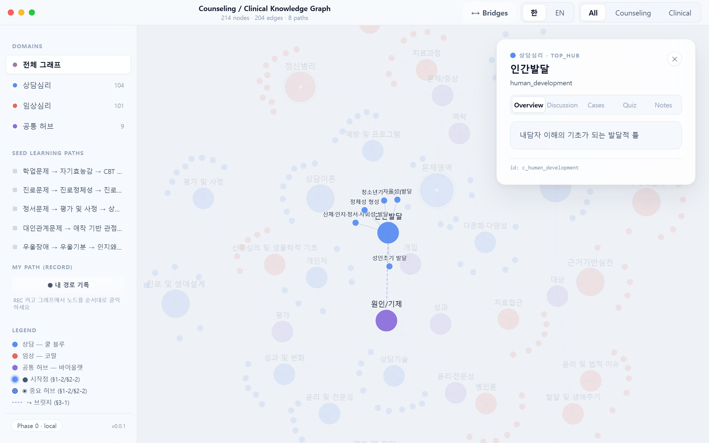 | 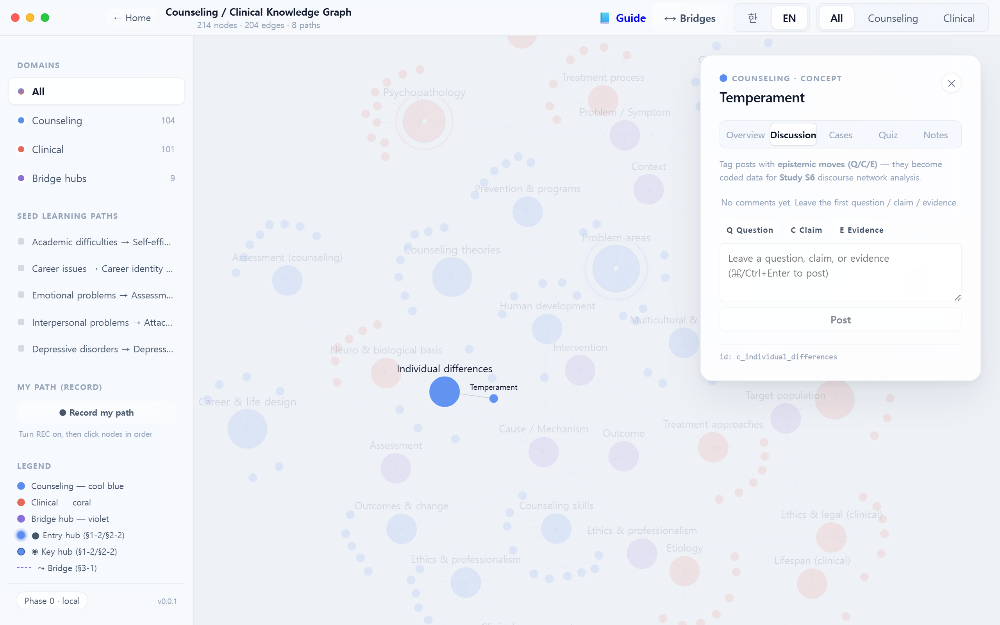 |
| **Case rubric (C3)** | **Personal notes (C4)** |
| 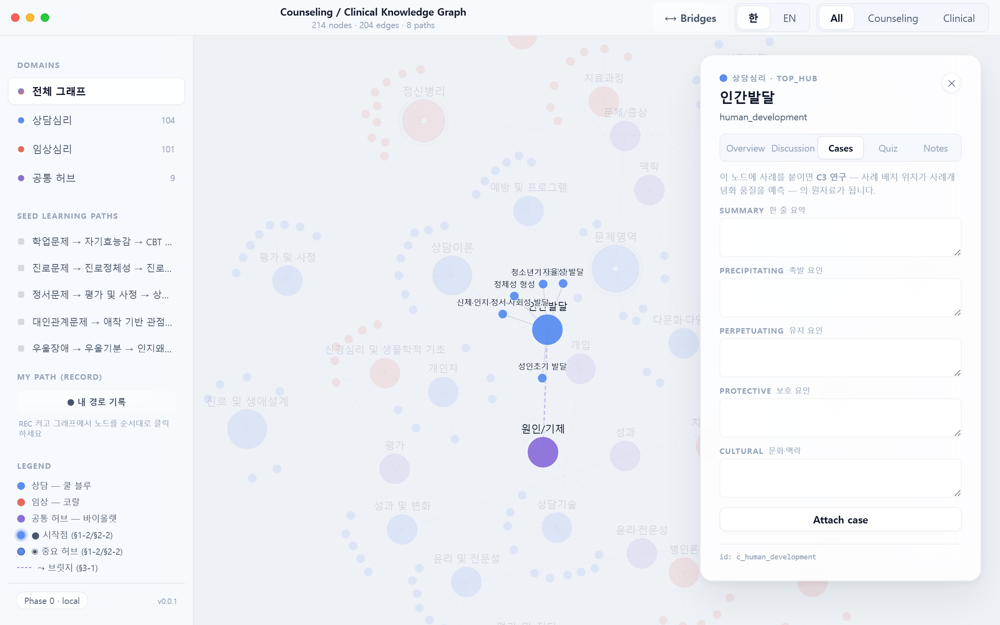 | 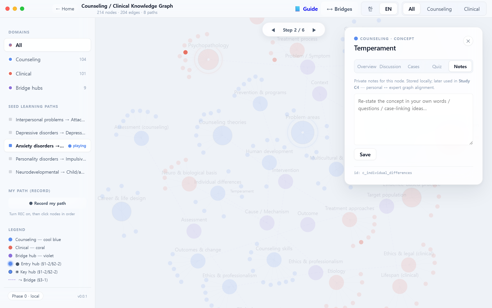 |

### Seed-path replay — progressive step reveal

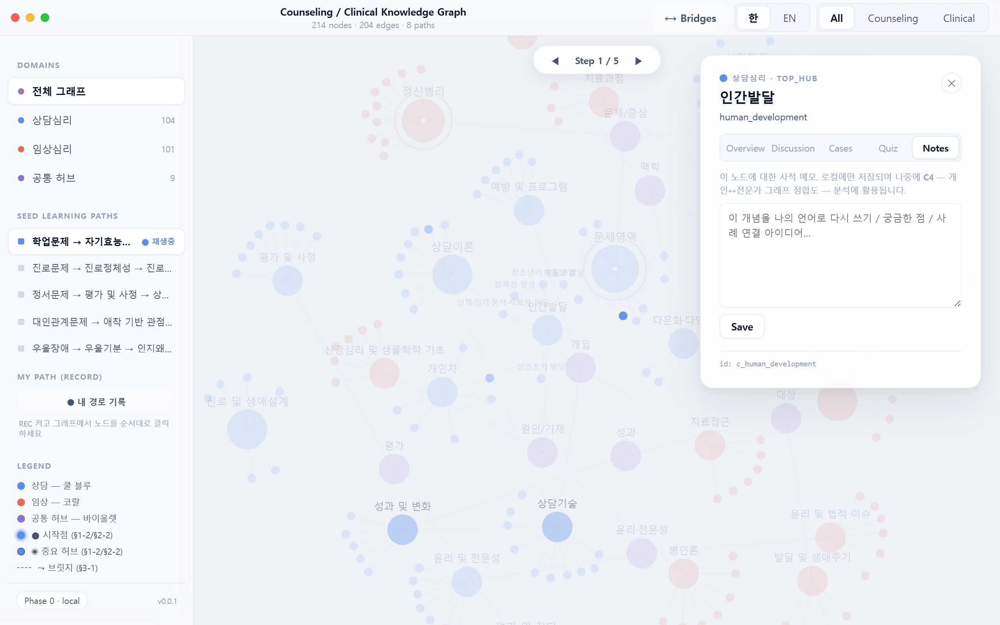

### Landing page (ko / en)

| Korean | English |
|---|---|
| 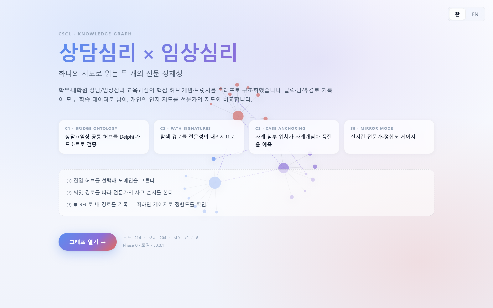 | 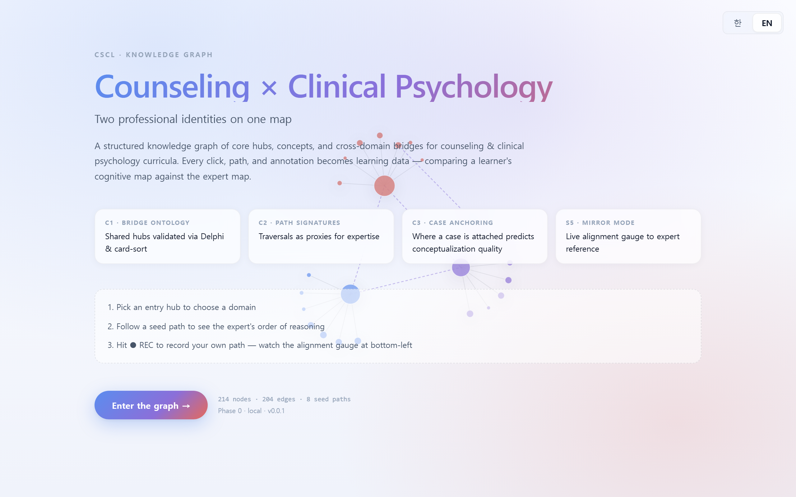 |

---

## Why this exists

Top-tier CSCL / LAK venues (ijCSCL, *Journal of the Learning Sciences*, *Computers & Education*, *Counselor Education and Supervision*, *Training and Education in Professional Psychology*) rarely see counseling- or clinical-psych-specific knowledge-graph work. This project treats that absence as an opportunity and ships a system whose very affordances are research instruments.

Two compounding contributions anchor the design:

- **C1 — Empirically validated bridge ontology.** The counseling↔clinical shared hubs are treated as a hypothesis to be validated by expert card-sort / Delphi, not as a given. The tool *is* the instrument that collects the validation data.
- **C2 — Learning paths as epistemic traces.** Every traversal is instrumented for sequence analysis (lag-sequential, process mining) so novice vs. expert path signatures become a dependent measure of clinical-reasoning development.

Supporting contributions — **C3** case-to-node anchoring as an experimental manipulation for case-conceptualization quality · **C4** core-personal graph alignment as a proxy for expert-schema convergence · **C5** cross-domain professional-identity formation · **S5** real-time Mirror Mode as metacognitive scaffolding (post-hoc analysis → learner-facing feedback loop, addressing a longstanding KBDeX/ONA limitation).

---

## What's in the repo

```
src/
  client/
    App.tsx                    entry + routing (landing ↔ graph)
    components/
      Landing.tsx              animated force-sim hero + CSCL contribution cards
      TitleBar.tsx             domain filter · bridges overlay · lang · home
      Sidebar.tsx              domains · seed paths · MyPath recorder · legend
      GraphCanvas.tsx          D3 force layout, 3-tier zoom, bridge overlay, label HMR
      NodeDetailPanel.tsx      Overview · Discussion (Q/C/E) · Cases · Notes
      AlignmentGauge.tsx       S5 Mirror Mode — real-time path-vs-expert similarity
    lib/
      eventLogger.ts           single chokepoint; posts to /api/events or localStorage ring-buffer in static mode
  server/
    index.ts                   Hono (Node adapter; Workers-portable)
    db/schema.ts               Drizzle (SQLite dialect, Postgres-compatible)
    routes/                    /api/graph, /api/events, ...
    lib/                       auth · realtime · storage adapter seams
scripts/
  seed-taxonomy.ts             parse Korean taxonomy markdown → seed JSON
  dump-graph.ts                dump SQLite graph → public/graph.json for static mode
  capture-guide.ts             Playwright — captures screenshots into public/guide/img/
public/
  guide/index.html             CSCL-aligned learner guidebook
```

---

## Data model

### Core ontology (versioned, immutable per snapshot)

```
CoreNode  { id, domain, level, label_ko, label_en, description, parent_hub_id?, version }
CoreEdge  { id, source_id, target_id, relation, confidence, version }
          relation ∈ { contains, related_to, prerequisite_of,
                       example_of, contrasts_with, bridges_to }
CoreSnapshot { id, created_at, author_id, note }   -- for reproducibility
```

`bridges_to` is the research-critical relation; its `confidence` is populated by Delphi rounds.

### Personal / collaborative layer

```
Annotation · PersonalEdge · CaseAttachment · LearningPath · Thread · Comment · QuizItem
```

Research-specific additions:

- `LearningPath.kind ∈ { student_free, student_assigned, expert_reference, seeded_template }`
- `CaseAttachment.conceptualization_rubric` — structured fields (precipitating, perpetuating, protective, cultural)
- `Comment.epistemic_move` — Q (Question) / C (Claim) / E (Evidence) at author time

### Research instrumentation

```
EventLog         { id, user_id, session_id, cohort_id, kind, payload_json, ts }
CardSortResponse { rater_id, concept_id, assigned_hub_id, round, ts }
DelphiRating     { rater_id, edge_id, round, rating, rationale }
AlignmentScore   { user_id, snapshot_id, metric, value, computed_at }
```

Events currently emitted: `node_open` · `node_dwell_end` · `edge_click` · `path_step` · `path_save` · `thread_open` · `comment_post` · `case_attach` · `quiz_answer` · `cursor_move` (sampled) · `zoom_change` · `filter_change` · `mirror_glance` · `note_save` · `recording_toggle` · `mypath_step` · `lang_change` · `landing_enter`.

Planned (see [research roadmap](#research-roadmap)): `bridge_traverse` · `geodesic_jump` · `zoom_tier_dwell` · `epistemic_ngram` · `case_reanchor` · `tab_sequence` · `gauge_to_action_latency`.

---

## UI modes

| Mode | Audience | Status |
|---|---|---|
| **Exploration** (default) | students | ✅ Phase 0 |
| **Card-sort** (round-based concept→hub assignment) | expert raters | ⏳ Phase B |
| **Delphi** (per-bridge confidence rating + rationale) | expert raters | ⏳ Phase B |
| **Admin / study-ops** (cohort · snapshot freeze · export · alignment dashboard) | instructors / researchers | ⏳ Phase D–E |

Only Exploration ships in Phase 0. Modes 2–4 are role-gated and planned per the phase roadmap below.

---

## Visualization

- **D3 force layout** with three zoom tiers — top-hub labels always visible; mid-hub labels reveal at k > 0.8; concept labels reveal at k > 1.6 or when neighbors of the selected/hovered node (contextual reveal).
- **Bridge overlay** — toggle `⟷ Bridges` to render only `bridges_to` edges, with width proportional to `confidence`. This is the visual artifact of C1.
- **Path replay** — animates a `LearningPath` as a traveling highlight; side-by-side replay (novice vs. expert) planned for Phase D.
- **Cohort dwell heatmap** — planned; reads aggregated `EventLog.node_dwell_end`.

---

## Getting started

### Prerequisites
- Node 20+
- macOS / Linux / Windows (with bash / Git Bash)

### Local dev

```bash
npm install
npm run dev      # web on :5173, Hono API on :8787 (concurrently)
```

Seed the SQLite graph from the Korean taxonomy markdown:

```bash
npm run seed
```

### Static bundle (for GitHub Pages)

```bash
npm run build:ghpages
```

This dumps `public/graph.json` from the SQLite seed, then builds with `base: /counseling-graph-cscl/`. The client detects `__STATIC_MODE__` at build time and fetches `graph.json` instead of `/api/graph`; `logEvent` writes to `localStorage` (ring buffer, last 500) instead of POSTing.

### Deploy

Pushing to `main` triggers [`.github/workflows/deploy.yml`](.github/workflows/deploy.yml) — `actions/deploy-pages@v4`.

---

## Tech stack

Chosen so a **later cloud decision costs zero rewrite** (swap three adapter files, not the app).

| Layer | Phase 0 (local) | Swap path later |
|---|---|---|
| Frontend | Vite + React 18 + TypeScript | — |
| Visualization | D3.js (force + radial toggle planned) | — |
| State | Zustand | — |
| Backend | **Hono** on Node | Same code → Cloudflare Workers / Deno / Bun |
| DB | **Drizzle + better-sqlite3** | → D1 (Cloudflare) or Postgres (Supabase / Neon) |
| Auth | Lucia / dev user switcher | → Clerk / Supabase Auth (one adapter file) |
| Realtime | local `ws` server | → Durable Objects / Supabase Realtime |
| File storage | `./uploads/` | → R2 / Supabase Storage |
| Analytics | SQLite → DuckDB / Parquet | Same pipeline scales to cloud |

All vendor-specific surfaces sit behind `lib/auth.ts`, `lib/realtime.ts`, `lib/storage.ts` — swapping cloud routes means replacing those three files.

### Cloud routes (deferred)

- **Route C (Cloudflare-only)** — Pages + Workers + D1 + Durable Objects + R2 + Clerk. ~$5/mo.
- **Route S (Supabase-centric)** — Supabase (Postgres + Auth + Realtime + RLS) + Cloudflare Pages frontend + R2. $0 → $25/mo. Better for heavy analytical SQL.

---

## Phased build order

| Phase | Target | Deliverable |
|---|---|---|
| **0 — Localhost scaffold** *(done)* | week 0 | `npm run dev` → open a node, event logs to SQLite, ko/en toggle, landing page, static GH-Pages build |
| **A — Instrumented core graph** *(in progress)* | week 1–2 | Bridge overlay + zoom tiers + node detail + event logger + snapshot freeze |
| **B — Expert validation modes** | week 3 | Card-sort + Delphi + researcher aggregate dashboard. **Recruit 8–12 experts · run 2 Delphi rounds → C1 data** |
| **C — Student CSCL features** | week 4–5 | Auth + cohorts + personal edges + annotations + threads + cases + quizzes + path share/replay + real-time cursors / follow |
| **D — Analytics + study exports** | week 6 | Alignment scores + cohort heatmap + Parquet/CSV exports + analysis notebooks. **Run pilot: novice cohort vs. expert reference → C2 metrics** |
| **E — Instructor polish** | week 7 | Core-graph editor + student-proposal moderation + version UI |

---

## Research roadmap

The tool is not a product — it is a vehicle for seven pre-registered studies. Each study reuses the same instrumentation; marginal cost per study is small.

| # | Study | Novelty | Design | Target venue |
|---|---|---|---|---|
| S1 | Ontology validation | C1 | Expert card-sort (n≈20) + two-round Delphi on bridges | *Counselor Education and Supervision* / *MECD* |
| S2 | Path signatures of expertise | C2 | Expert (n≈10) vs. graduate trainees (n≈60) traverse same scenarios; lag-sequential + process mining on `EventLog` | *ijCSCL* / *Computers & Education* |
| S3 | Case-placement → conceptualization quality | C3 | Within-subject; raters score conceptualizations; correlate with node choice | *Training and Education in Professional Psychology* |
| S4 | Core-personal alignment over time | C4 | Longitudinal graph-edit-distance across a semester | *Journal of the Learning Sciences* |
| S5 | **Mirror Mode — real-time metacognitive scaffolding** | L1 | Randomized trial: gauge-visible vs. gauge-hidden; measure path-alignment trajectory + SRL inventory | **ijCSCL** |
| S6 | Tri-layer network analytics for Korean CSCL discourse | L4 | Ontology × discourse × path networks; KoNLPy + KBDeX-style bipartite; validate against Oshima benchmark | *Computers & Education* |
| S7 | Phase-transition detection in knowledge-building trajectories | L7 | HMM / Bayesian changepoint on `EventLog`; compare detected phases vs. expert-coded phases | *ijCSCL* / *Learning and Instruction* |

### Positioning vs. the KBDeX / ONA / ITM lineage

| Limitation in prior work | Our response | Where |
|---|---|---|
| L1  Post-hoc only (no learner-facing loop) | Mirror Mode | `AlignmentGauge.tsx`, `lib/alignment.ts` |
| L2  Word co-occurrence only; no conceptual hierarchy | Layered ontology + `bridges_to` relation | `core_nodes`, `core_edges` |
| L3  No ground truth; expertise judged interpretively | Expert reference paths + graph-edit-distance | `learning_paths.kind='expert_reference'` |
| L4  English-centric discourse segmentation; brittle on Korean | Tri-layer: KoNLPy morpheme bipartite + ontology + path | `scripts/analyze/discourse_kr.py` (planned) |
| L5  Domain-generic; weak on bridge-heavy domains | Counseling↔clinical `bridges_to` w/ Delphi confidence | `core_edges.confidence` |
| L6  Individual-vs-group split | Two-layer graph + alignment bridges them | core/personal layers |
| L7  Manual ONA windowing; no phase-transition detection | HMM / changepoint on `EventLog` | `scripts/analyze/phases.py` (planned) |

---

## Pedagogy — the six CSCL principles embedded

The tool is useless without this framing. From [`public/guide/index.html`](public/guide/index.html):

1. **Knowledge co-construction** — concepts are collectively constructed via Discussion / Case / Notes, not delivered.
2. **Epistemic agency** — learners tag their own posts Q / C / E, taking explicit responsibility for epistemic acts.
3. **Traceable learning trajectories** — all clicks, dwells, and paths are logged as material for expert-path comparison and self-reflection.
4. **Metacognitive scaffolding** — S5 Mirror Mode returns real-time alignment to expert structure.
5. **Bridge-based identity formation** — exploring counseling↔clinical bridges *is* the process of forming a boundary-crossing professional identity.
6. **Knowledge is revisable** — Delphi / card-sort modes update bridge-edge confidence by vote. The ontology itself is a working hypothesis.

### Session cycle (one knowledge-building unit)

> **Enter** (with a question) → **Survey** (bridges · domain compare) → **Argue** (Q/C/E in Discussion) → **Apply** (anchor case · integrate notes) → **Reflect** (record path · gauge self-alignment).

---

## Verification plan

- **Seed integrity** — every top-hub and concept in §1-1, §1-3, §2-1, §2-3 of the source taxonomy maps to a node; four paths each in §1-4, §2-4 resolve to valid node sequences; §3-1 shared nodes carry `bridges_to` edges to both domains.
- **Instrumentation completeness** — synthetic user session emits ≥1 event for every interactable surface; no UI action is silent.
- **Privacy / RLS** — student A cannot read student B's private notes; instructor can read aggregates but not raw notes unless consented; researcher exports exclude PII.
- **Research-mode correctness** — card-sort responses reconstruct to a concept × hub matrix with correct row / column counts; Delphi round-2 displays round-1 anonymized aggregates correctly.
- **Analytics sanity** — alignment of an expert's own trace vs. expert snapshot ≈ 0; random trace ≈ theoretical max; novice trace falls between and decreases monotonically across a semester in pilot data.
- **End-to-end CSCL loop** — instructor freezes snapshot → expert A records reference → student B records novice path → admin dashboard shows both + similarity + CSV export.

---

## Open questions (before Phase B)

- **IRB / consent flow.** Required before any human-subject logging. A consent gate on first login is planned.
- **Expert recruitment.** n ≈ 8–12 licensed counselors / clinicians for Phase B Delphi.
- **Language scope.** Currently bilingual-ready schema, but ~80% of concept nodes still lack `label_en`. Tracked in issues.
- **Cohort scale.** Target for S2 (affects whether Supabase Realtime tier suffices).

---

## Contributing

Research collaborators, reviewers, and instructors are welcome. For code contributions:

1. Fork; branch off `main`.
2. `npm run dev`, make changes, verify locally.
3. Keep the adapter seams (`lib/auth.ts`, `lib/realtime.ts`, `lib/storage.ts`) vendor-free.
4. Never commit `data/*.db` or `public/graph.json` (already in `.gitignore`).
5. PRs describing research-relevant changes should reference the affected study (S1–S7) and contribution (C1–C5) in the title.

For expert participation (card-sort / Delphi rounds) or cohort piloting, please open a GitHub Discussion.

---

## Citing this work

If you use this instrument or dataset in published research, please cite as (placeholder — to be updated on first preprint):

```
Kim, J. et al. (2026). Counseling × Clinical Knowledge Graph — a CSCL research
instrument for bridge ontology validation and path-signature analysis.
https://github.com/Educatian/counseling-graph-cscl
```

---

## License

MIT for code. Ontology (`src/data/core-graph.seed.json`) and taxonomy markdown are CC BY-NC-SA 4.0 until expert validation (S1) completes; will be relicensed CC BY 4.0 upon publication.
