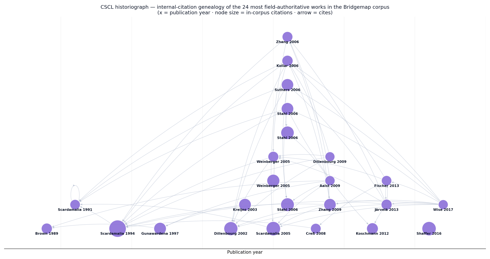

# Bridgemap's Theoretical Position in CSCL — a scientometric analysis

> A science-of-science study locating this app (a bilingual counseling × clinical
> knowledge graph) inside the Computer-Supported Collaborative Learning (CSCL)
> discourse. Corpus collected via OpenAlex, citation genealogy built with
> networkx, science-of-science scaffolding via `pyscisci`. Every number below is
> reproducible from [`cscl-positioning/scripts/`](cscl-positioning/scripts) (collect.py → analyze.py → genealogy2.py).

---

## 1. Method & corpus

| | |
|---|---|
| **Source** | OpenAlex REST API (polite pool) |
| **Seeds** | ijCSCL flagship journal (`S64184962`, 495 works) · CSCL concept (`C2778515922`) top-cited · Knowledge Building concept (`C2778484570`) top-cited · title anchors: *epistemic network analysis*, *knowledge forum*, *KBDeX*, *knowledge-building community*, *group cognition* |
| **Corpus** | **2,357 unique works, 1979–2026** (2,127 with reference lists) |
| **Internal citation graph** | 2,357 nodes · **11,670 internal citation edges** |
| **Authority metric** | in-corpus in-degree (field-internal citations) + PageRank (α=0.85) on the internal citation network |

*Tool honesty.* `pyscisci`'s disruption/CD index needs each focal paper's **full**
citing-set references (the ego network beyond the corpus), which an API-scoped
collection does not contain — so it is **not** reported (it would be unreliable on
internal-only edges). Field authority is therefore measured by in-corpus citation
in-degree + PageRank, which are valid on the induced subgraph.

---

## 2. The fundamental works (field-internal authority)

Top of the 2,357-paper corpus by **in-corpus citations** (`g` = global citations):

| # | In-corpus | PageRank | Work | What it grounds |
|---|---|---|---|---|
| 1 | **203** | .021 | **Scardamalia & Bereiter 1994** — *Computer Support for Knowledge-Building Communities* | the entire premise: a shared, persistent knowledge object a community improves |
| 2 | 139 | .007 | **Scardamalia 2005** — *Knowledge Building* | the 12 KB principles; Knowledge Forum lineage |
| 3 | **137** | .007 | **Shaffer et al. 2016** — *A Tutorial on Epistemic Network Analysis* | sequence/connection analysis of discourse |
| 4 | 132 | .008 | **Dillenbourg 2002** — *Over-scripting CSCL* | the scaffolding-vs-freedom tension |
| 5 | 125 | .006 | **Stahl 2006** — *Group Cognition* | knowledge as a group-level artifact |
| 6 | 112 | .005 | **Weinberger & Fischer 2005** — *A framework to analyze argumentative knowledge construction* | the Question / Claim / Evidence move grammar |
| 7 | 106 | .010 | **Gunawardena et al. 1997** — *Interaction Analysis Model* | coding online knowledge co-construction |
| 8 | 105 | .005 | **Kreijns et al. 2003** — *Pitfalls for social interaction in CSCL* | why mere tooling ≠ collaboration |
| 9 | 104 | .004 | **Stahl, Koschmann & Suthers 2006** — *CSCL: An historical perspective* | the field's self-definition |
| 10 | 103 | .004 | **Zhang et al. 2009** — *Collective Cognitive Responsibility* | distributed ownership of a shared knowledge space |
| 11 | 102 | .004 | **Suthers 2006** — *Technology affordances for intersubjective meaning making* | "the affordance **is** the research instrument" |
| — | 73 | **.037** | **Scardamalia 1991** — *Higher Levels of Agency for Children in Knowledge Building* | **highest PageRank**: the genealogical root on learner agency |
| — | 82 | .017 | **Brown, Collins & Duguid 1989** — *Situated Cognition* | the external root feeding the whole tree |
| — | 80 | .002 | **Järvelä & Hadwin 2013** — *Regulating Learning in CSCL* | real-time/self-regulated feedback |

Full ranking: [`cscl-positioning/fundamental-works-ranked.csv`](cscl-positioning/fundamental-works-ranked.csv).

---

## 3. The historical tree (citation genealogy)

Reading the genealogy left→right (x = year, node size = in-corpus authority):

- **Roots (1989–1994).** Brown/Collins/Duguid 1989 (*situated cognition*) feeds
  Scardamalia & Bereiter's **Knowledge Building** program — 1991 (*agency*, the
  PageRank apex) → 1994 (*knowledge-building communities*, the most-cited node).
  This is the **taproot** the app sits on.
- **The 2005–2006 trunk.** The field consolidates: Stahl's *Group Cognition*,
  Suthers' *intersubjective affordances*, the **script-theory branch** (Dillenbourg
  2002 → Weinberger & Fischer 2005 → Kollar 2006 → Fischer 2013), and the
  *historical-perspective* self-definition. CSCL becomes a discipline.
- **The analytics branch (2009–2017).** Zhang's *collective cognitive
  responsibility*, then the **measurement turn**: Järvelä's regulation lens and
  **Shaffer's Epistemic Network Analysis (2016)** — plus KBDeX (Oshima) from the
  Knowledge Building side. This is where *discourse becomes a network you can
  measure*.

Field volume peaked **2005–2014** (485 + 499 works/5yr) and remains steady
(~450/5yr through 2024) — a **mature field still publishing**, i.e., open to
re-tooling rather than exhausted.

---

## 4. Where Bridgemap's architecture meets the discourse

This is the core claim: **every functional component of the app operationalizes a
specific node in the genealogy above** — it is not a generic graph tool, it is a
CSCL instrument assembled from the field's own canon.

| App architecture (feature / contribution) | CSCL discourse it instantiates | Anchor work(s) |
|---|---|---|
| **Knowledge graph as the shared workspace** (the whole app) | community knowledge object that learners collectively improve; group cognition | Scardamalia & Bereiter 1994 · Stahl 2006 |
| **C1 — Bridge ontology** (counseling↔clinical shared hubs, validated by Delphi/card-sort) | collective cognitive responsibility over a shared epistemic structure; affordance-as-instrument | Zhang 2009 · Suthers 2006 |
| **Q · C · E discussion moves** (Question / Claim / Evidence tags on nodes) | argumentative knowledge construction; epistemic/social scripts | **Weinberger & Fischer 2005** · Gunawardena 1997 |
| **C2 — Path signatures** (every traversal logged for sequence analysis; novice vs expert) | epistemic network / discourse-as-connections; KBDeX discourse explorer | **Shaffer 2016 (ENA)** · Oshima (KBDeX) |
| **S5 — Mirror Mode** (real-time learner-facing alignment gauge) | regulation of learning in CSCL — moved from analyst-only to **learner-facing**, closing a known KBDeX/ENA post-hoc limitation | Järvelä & Hadwin 2013 |
| **Entry hubs · discovery prompts · spotlight tutorial** (low-agency scaffolds) | *higher levels of agency*; the over-scripting tension (scaffold without removing inquiry) | **Scardamalia 1991** · Dillenbourg 2002 |
| **C3 — Case anchoring** (attach a case to a node; where you anchor predicts quality) | situated cognition — knowledge indexed to authentic context | Brown, Collins & Duguid 1989 |
| **C4 — Core–personal graph alignment** (expert-schema convergence proxy) | knowledge building toward community/expert knowledge | Scardamalia 2005 |
| **C5 — Cross-domain professional identity** | knowledge-building community membership across two fields | Scardamalia & Bereiter 1994 |

**One-line positioning.** *Bridgemap re-assembles the Knowledge-Building taproot
(Scardamalia & Bereiter) + the argumentation-script branch (Weinberger & Fischer)
+ the measurement turn (Shaffer's ENA / Oshima's KBDeX) into a single instrumented
artifact, and moves the measurement layer from post-hoc analyst tool to a
real-time learner-facing scaffold (Järvelä) — in a domain CSCL has barely touched.*

---

## 5. The gaps (quantified) — Bridgemap's white space

OpenAlex counts, **constrained to the CSCL concept** (`n ≈ 2,519` field works) so
they are true intersections, not free-text noise:

| Intersection within CSCL | Works | Gap |
|---|---|---|
| CSCL ∩ **counseling** | **14** | domain almost untouched |
| CSCL ∩ **clinical psychology** | **29** | "" |
| CSCL ∩ **psychotherapy** | **1** | effectively empty |
| CSCL ∩ **counselor education** | **5** | "" |
| CSCL ∩ knowledge graph | 97 | KG-as-instrument is thin |
| CSCL ∩ ontology | 61 | "" |
| CSCL ∩ epistemic network analysis | 84 | measurement turn still young |
| Knowledge Building ∩ real-time feedback | 89 | mostly analyst-facing, not learner-facing |
| Knowledge Building ∩ KBDeX | 19 | a narrow specialist line |

**Four gaps, in order of distinctiveness:**

1. **Domain gap (widest).** Of ~2,519 CSCL works, **counseling/clinical/
   psychotherapy education is essentially absent** (14 / 29 / 1 / 5). CSCL is a
   STEM- and general-education field; professional-psychology training is a near-
   empty cell. Bridgemap's *first* contribution is simply being there.
2. **Artifact gap.** A **validated knowledge-graph / bridge-ontology** used *as the
   CSCL treatment itself* (not a static reference) is rare (KG 97, ontology 61) —
   and the counseling × KG intersection is near-zero.
3. **Methodological gap.** ENA/KBDeX (84 / 19) are powerful but **post-hoc, analyst-
   facing**. A **real-time, learner-facing** epistemic-alignment signal (Mirror
   Mode) addresses a limitation the literature itself names — KB ∩ real-time
   feedback is only 89, and learner-facing variants rarer still.
4. **Bridge gap.** A **cross-professional-identity bridge ontology** (counseling ↔
   clinical) treated as a validatable hypothesis is, in this corpus, novel.

---

## 6. Positioning statement (for the manuscript / IRB framing)

> Bridgemap is a CSCL **research instrument** in the Scardamalia–Stahl Knowledge-
> Building tradition, operationalizing argumentative knowledge construction
> (Weinberger & Fischer) and the epistemic-network measurement turn (Shaffer;
> Oshima) over a **validatable bilingual bridge ontology** of counseling and
> clinical psychology — a domain CSCL has scarcely entered (≤30/2,519 works). Its
> distinctive move is to convert the field's post-hoc analytic layer into a
> **real-time, learner-facing metacognitive scaffold** (Järvelä), so the artifact's
> affordances *are* the instruments (Suthers).

**Reproduce:** `cd docs/cscl-positioning/scripts && python collect.py && python analyze.py && python genealogy2.py` (writes corpus + rankings + historiograph).
